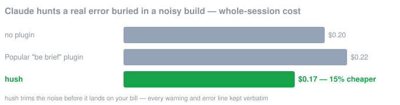

<div align="center">
  
  <h1>hush</h1>
  <p><strong>Makes Claude quieter and your sessions cheaper — less narration, less noise, one clear answer at the end.</strong></p>
</div>

---

## What is this?

You know the pattern: "Let me start by looking at…", "Now I'll check…", a 400-line wall of build output, and finally the one thing you actually wanted to know. All of it costs money — every word in a session is billed — and buries the useful part.

hush trims it at the source. Claude works quietly, tidies up noisy command output and bulky log files before they pile up, and gives you **one clear answer at the end**. Code, error messages, and anything you ask it to explain stay complete — hush never shortens the parts that matter.

## Why you'd want it

- **Cheaper sessions.** It shrinks the two biggest sources of bulk — noisy output and narration — so long sessions cost less.
- **Easier to read.** The answer sits at the top of one final message, not buried in a play-by-play.
- **Nothing important is lost.** Failing command output, code, diffs, and security warnings are kept whole.
- **Zero setup.** Install it and it's on. Tune it later only if you want to.

## Install

Inside Claude Code, run:

```
/plugin marketplace add V-Songbird/foundry
/plugin install hush
```

The quiet style takes effect at your next session. There's nothing to invoke — hush just works in the background.

## Benchmarks

We put hush up against plain Claude Code and the popular "just be brief" plugin on real engineering work — full agent sessions that explore, edit, and run code, not a single canned reply — the same jobs, phrased the way a developer actually types them, three setups, and the real bill read straight from the API.

<p align="center"></p>

**Claude stops narrating and just works.** On real fix-the-bug jobs, plain Claude says about ninety words of play-by-play before you get the answer. hush cuts that to under a third — quieter than the brief plugin too — and puts everything that matters in one clean final message.

<p align="center"></p>

**Noise gets cheaper — and the brief plugin can backfire on it.** When a job means wading through a noisy build or a bulky log, hush trims the clutter before it lands on your bill, with every warning and error line kept verbatim. The brief plugin actually costs *more* than doing nothing on this kind of job — shorter replies don't help when the bulk was never in the reply to begin with.

Across the full suite, hush's sessions ran cheaper than plain Claude Code by a wider margin than the brief plugin managed. And the part that matters most: **nothing broke.** Every job passed in every setup.

> [!NOTE]
> On short everyday tasks, no plugin of this kind makes sessions much cheaper — a session's fixed overhead dwarfs what any of them can trim, the brief plugin included. hush's everyday win is what you *read*, not what you pay; the savings above show up once noise does.

*How we tested: same jobs, three setups, several runs each in fresh throwaway workspaces, on Sonnet — a full multi-turn agent session every time, never a single generated reply — costs from the API, not estimates. Reproduce it yourself — see [benchmarks/](benchmarks/).*

## Compress a memory file

`/hush:hush-compress <path>` shrinks a `CLAUDE.md` or notes file into a tighter form, so every future session that loads it costs a little less.

> [!IMPORTANT]
> It never touches your original — it writes a copy alongside it (`CLAUDE.md` → `CLAUDE.hush.md`) for you to review and swap in yourself.

## Under the hood

If you're curious, hush just works quietly in the background — nothing is re-sent every turn to run up your bill — and it's all there to read in the plugin's files. Pairs naturally with [razor](https://github.com/V-Songbird/razor): razor cuts the code and the cost, hush cuts the noise — and measured together, they add no overhead to each other.

## Settings

Most people never touch these, but a few environment variables tune the caps or turn parts off:

| Variable | What it does |
| --- | --- |
| `HUSH_DISABLE=1` | Turns the hooks off |
| `HUSH_CAP_PASS=60` | Lines kept from successful command output |
| `HUSH_CAP_FAIL=250` | Lines kept from failing output |
| `HUSH_NARRATION_BUDGET=120` | Words of narration before a gentle nudge |

## License

MIT — see [LICENSE](./LICENSE).
