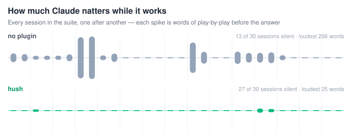
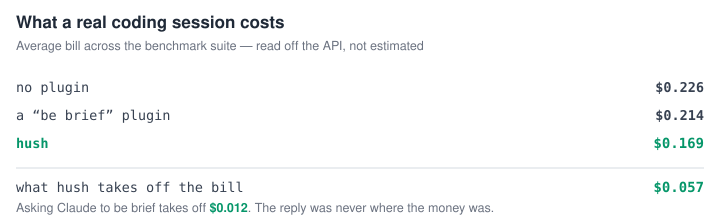
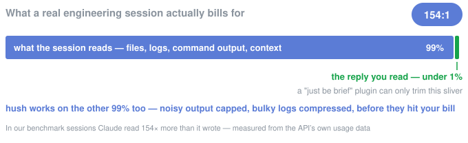
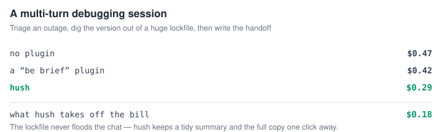

<div align="center">
  <picture>
    <source media="(prefers-color-scheme: dark)" srcset="assets/logo-dark.svg" />
    
  </picture>
  <h1>hush</h1>
  <p><strong>Claude talks a lot while it works, and you pay for every word. hush turns down the chatter.</strong></p>

  

  <p><em>This is what a session sounds like.</em></p>
</div>

<p align="center">
    <a href="https://github.com/V-Songbird/hush/stargazers"></a>
    <a href="https://github.com/V-Songbird/hush/blob/main/LICENSE"></a>
    <a href="https://docs.anthropic.com/en/docs/claude-code"></a>
</p>

> **TL;DR** — Claude bills you for every log line, build dump, and word of play-by-play. hush trims them at the source in the loud sessions, taking our benchmark suite's average from $0.179 to $0.159. Short, quiet jobs have nothing to cut and can cost a little more.

---

## What is this?

Claude talks a lot while it works. "Let me look at the codebase." "Now I'll check the config." Then four hundred lines of build output you never asked for — and, right at the end, the one sentence you actually needed.

hush doesn't ask Claude to "be more concise" and hope for the best. It trims the actual bulk — logs, command output, narration — at the source, before any of it hits your bill. It's a specialist, and it says so on the tin: it earns its keep in sessions that read logs, run builds, and keep going turn after turn, because that's where the noise lives. Ask it a one-shot question with no tools involved and there's nothing to trim — you'll pay hush's own small overhead for the quieter reply.

And the one message you do get is built to be read on an empty tank. Answer first. Everyday words instead of jargon, because swapping a word is free and explaining one costs you a line. Hard caps on the whole thing: 12 lines, 15 words a sentence. If you have ADHD, or you're just fried at the end of a long day, that's the point — nothing to wade through, and nothing you're assumed to already know.

## Why you'd want it

- **Cheaper noisy sessions.** The two biggest sources of bulk — machine output and narration — get shrunk, so the long, loud sessions cost less.
- **Easier to read.** The answer sits at the top of one final message, not buried in a play-by-play.
- **Your files are never touched, and big output is saved before it's shortened.** Anything large enough to be parked out of the chat is written whole to a local file the summary points at. Smaller trims keep the lines that carry signal — errors, warnings, failures — and drop the repetitive middle, and a failing command gets far more room than a clean one.
- **Zero setup.** Install it and the trimming and the quiet final message are on. Voices and the document rewriter wait until you ask for them by name.

## How it works

hush picks up five small habits the moment you install it:

| Moment | What happens |
| --- | --- |
| Progress narration | Swapped for one clean summary at the end |
| Command output & log files | Trimmed as they come in — a short tail from a clean run, up to 250 lines from a failing one, with the error and warning lines pulled through |
| Mid-turn rambling | Caught by a running word count and cut off the moment it starts |
| Really large output (a huge log, a giant lockfile) | Parked in a local file behind a short summary, so it isn't re-sent in full every turn |
| Re-reading a file that changed on its own | Shown as the added and removed lines, not the whole file again |

That's the whole list. No workflow to learn, no dial to find first. It's simply how Claude behaves now.

All five are the default experience: **Core** trims the machine output, **Quiet** handles the silence and the answer-first final message. Two more surfaces sit off to the side until you name them — **Voices**, the style shelf (`/hush:pick-style`, `/hush:craft-style`), and **Draft**, the document rewriter (`/hush:hush-compress`). Neither switches itself on, and nothing rewrites a file of yours unless you run that last command.

## Install

Inside Claude Code, run:

```
/plugin marketplace add V-Songbird/foundry
/plugin install hush@foundry
```

It kicks in at your next session — nothing to configure. hush works quietly in the background.

Running [razor](https://github.com/V-Songbird/razor) too? Good instinct — the pair is measured in [Better together](#better-together) below.

## What you can do

hush runs itself. These commands are just extras:

| You want to… | Command |
| --- | --- |
| Draft a shorter `CLAUDE.md` or notes file, for you to review and swap in | `/hush:hush-compress <path>` |
| See what hush trimmed this session | `/hush:stats` |
| Try one of the output styles hush ships, or hand back to stock | `/hush:pick-style` |
| Build an output style in your own voice on hush's silent frame | `/hush:craft-style` |

> [!IMPORTANT]
> `hush-compress` never touches your original — it writes a copy alongside it (`CLAUDE.md` → `CLAUDE.hush.md`) and refuses to overwrite one that's already there. Frontmatter is carried across byte for byte, and a verifier flags every number, path, link, code block, identifier, and dropped "not" it can't account for in the draft. It catches likely omissions; it can't prove the shorter file still means the same thing. That's the review's job, and it's yours.

`/hush:stats` needs `HUSH_DEBUG=1` set before the work you want measured. Without it there's nothing to report — and it'll tell you so.

`/hush:pick-style` is the shelf. Every style on it runs the same silent machinery underneath — they differ only in what that one last message is *for*:

| Style | What the final message does |
| --- | --- |
| **Glyph** | Emoji-telegram reports — an emote replaces each obvious word |
| **Rock** | Stone Age dialect — noun chains, no articles, `=` for cause |
| **Pirate** | Every report in full pirate dialect, outcome first |
| **Sensei** | Teaches the change at newcomer depth — the why and how, closed by a `Lesson:` and a `Check:`. No length cap |

`/hush:craft-style` goes one further: your own voice, written to a file you own, and a verifier that checks hush's mechanics came through the rewrite — every number, every cap, every rule, one paragraph for one paragraph.

Ask for a pirate and you get a pirate — `be` for is, `ye` for you, dropped g's, the whole way through, with the paths and the error text still exact. The trick is that your voice gets written into every line of the style file, not just the line that names it: Claude answers in the register it was handed. `craft-style` does that part for you. Want it terser than stock's readability rules allow? Ask for maximum compression — the skill strips the readability frame Rock-style, keeps the silence and the exact-facts contract, and tells you what you traded.

Both commands ask before they swap, both take effect at your next session, and stock hush is always one command away. One honest caveat: only the built-in style is benchmarked — the presets and anything you craft are unmeasured, and the numbers on this page belong to stock.

**See them side by side.** Same bug, same fix, five sign-offs — [`styles/README.md`](styles/README.md).

## Benchmarks

We put hush up against plain Claude Code and two rivals — caveman, which tells Claude to talk less, and an all-round "efficiency mode" plugin — on 15 fixed jobs: full agent sessions that explore, edit, and run code in seeded throwaway repos built for the purpose. Same jobs, phrased the way a developer actually types them, real cost read straight from the API.

<p align="center"></p>

**Being brief isn't enough.** Asking Claude to talk less saves under half a cent. An efficiency mode saves about one cent. hush saves two. Asking politely and actually doing the work turn out to be very different things.

<p align="center"></p>

**Almost the whole bill is what Claude *reads*,** not what it writes back. A plugin that only shortens the reply is working on two cents of an eighteen-cent session. hush trims the logs and output before they ever hit your bill.

<p align="center"></p>

**It shows most in longer sessions.** Drag a huge file into a multi-turn conversation and that bulk gets re-sent every turn. hush keeps a tidy summary in the chat and the full copy one read away — that outage session came in at $0.28 against $0.43. Neither rival moved it more than a cent and a half.

<p align="center"></p>

**And you read a third less.** Across the suite the replies come to 95 words against 145 — one message at the end, answer first, instead of pieces trickling in while Claude works.

**And it mostly stays quiet until it's done.** That's the waveform at the top of this page — every session in the suite, one spike per run. hush is silent in 27 sessions out of 30. It isn't a gag order: Claude still speaks up to flag something you'd want to stop, or when it's blocked and needs you.

### The full picture

Every job, every setup — the wins **and** the ties and losses. Cheapest per row in **bold**.

| What Claude did | no plugin | caveman | "efficiency mode" | hush |
| --- | --- | --- | --- | --- |
| Triage a production outage log | $0.294 | $0.290 | $0.300 | **$0.156** |
| Multi-turn incident + write the handoff | $0.427 | $0.424 | $0.414 | **$0.281** |
| Find a connection leak from incident logs | $0.283 | $0.241 | $0.199 | **$0.192** |
| Digest a 700-line CI log | $0.191 | $0.175 | $0.176 | **$0.140** |
| Find the error in a noisy build | $0.178 | $0.188 | **$0.148** | $0.165 |
| Clean up a build after a dependency bump | $0.191 | $0.219 | **$0.170** | $0.211 |
| Chase a flaky rounding bug through pricing tests | $0.216 | $0.165 | **$0.155** | $0.191 |
| Hunt a cross-file currency bug | **$0.134** | $0.137 | $0.147 | $0.175 |
| Fix an expired-token auth bug | **$0.119** | $0.139 | $0.136 | $0.149 |
| Fix a pagination bug | **$0.109** | $0.118 | $0.128 | $0.135 |
| Rename an API across a codebase | $0.210 | $0.205 | **$0.204** | $0.214 |
| Summarize a repo | $0.122 | **$0.113** | $0.135 | $0.144 |
| Explain a React re-render (no tools) | **$0.063** | $0.069 | $0.074 | $0.082 |
| Explain rebase vs merge (no tools) | **$0.060** | $0.067 | $0.075 | $0.077 |
| Write an email validator (no tools) | $0.079 | **$0.074** | $0.087 | $0.077 |
| **Average** | $0.179 | $0.175 | $0.170 | **$0.159** |

Every job passed its correctness check in every setup — not one cheaper-but-wrong answer.

> [!IMPORTANT]
> Read the rows, not just the last one. hush wins where there's noise to cut — logs, long sessions, multi-turn debugging — and it **loses** on short, low-output jobs, where its own overhead is bigger than anything it can trim: $0.077 against $0.060 on a no-tools explanation, $0.135 against $0.109 on a small bug fix. The average is the average of *this* suite with every job weighted the same. Your bill will follow whichever rows look like your work.

*How we tested: same jobs, four setups, several runs each in fresh throwaway workspaces, on Sonnet — headless agent sessions driven end to end, never a single generated reply — costs read from the API, not estimated. The repos are purpose-built fixtures, not open-source checkouts, and one of the 15 jobs runs across several turns. Numbers move a few percent between runs. Reproduce it yourself — see [benchmarks/](benchmarks/).*

### Better together

We ran the pair too — hush alongside [razor](https://github.com/V-Songbird/razor) — against the rival pair, caveman with ponytail. Ours came out cheapest on both models, and was the only setup that never turned in a wrong answer. The rival pair actually managed to cost more than running no plugin at all. The difference is enforcement: caveman and ponytail *ask* — talk less, build lean — and asking works right up until the model forgets. hush and razor fire on every session, whether Claude is in the mood or not.

## Under the hood

Every trim above happens locally as Claude works — read the plugin's files if you want the exact mechanics. `craft-style` copies those measured mechanics verbatim into a new style file in your own `output-styles` folder, checked by a mechanical verifier; the four shipped presets are built the same way and pass the same verifier. With your say-so `pick-style` swaps whichever one you chose into hush's own slot so it binds like stock, and swaps stock back on request. A plugin that takes plugins, more or less. Pairs naturally with [razor](https://github.com/V-Songbird/razor): razor cuts the code, hush cuts the noise. Run both and neither notices the other — measured as a pair, they're the setup we'd pick ourselves (see [Better together](#better-together)).

## Settings

Most people never touch these. A few environment variables tune the caps or turn parts off:

| Variable | What it does |
| --- | --- |
| `HUSH_DISABLE=1` | Stops every hook — no compression, no reminders, no files written. The output style is a separate switch: run `/hush:pick-style` to hand the slot back to stock, or uninstall |
| `HUSH_CORE=off` | Turns Core off and leaves Quiet running: command output arrives whole, nothing is parked in a file, nothing is recorded |
| `HUSH_QUIET=off` | Turns Quiet's reminders off and leaves Core trimming: no mid-turn nudge, no narration budget, no subagent brief. The output style is the other half of Quiet and is a separate switch — see `HUSH_DISABLE` |
| `HUSH_NARRATION_BUDGET=120` | Words of narration allowed before hush steps in |
| `HUSH_SIDECAR=off` | Keeps big output inline instead of moving it to a file |
| `HUSH_DELTA=off` | Shows the whole file again on a re-read instead of just what changed |
| `HUSH_DEBUG=1` | Turns on the record `/hush:stats` reads from |

There are no compression levels and no profiles. hush has one policy; these switches turn parts of it off, they don't dial it up. `HUSH_DISABLE=1` wins over everything, and a surface switch wins over the smaller switches inside it — `HUSH_QUIET=off` keeps every one of Quiet's reminders off, no matter how the individual reminders are tuned.

## Good to know

- **Getting the full output back.** When hush parks something big in a file, the summary names that file — read it and you have every byte. If the file is gone, run the command again; a second run isn't guaranteed to produce the same output as the first, so hush never claims it regenerates what was lost.
- **Turning it off is two switches.** `HUSH_DISABLE=1` stops everything hush does while a session runs. The output style is separate — it's chosen at session start, so hand the slot back with `/hush:pick-style`, or uninstall.
- **Core and Quiet come apart.** Want the trimming without the reminders, or the reminders without the trimming? `HUSH_CORE=off` and `HUSH_QUIET=off` are independent — either one leaves the other running.
- **Where the parked output lives.** Your operating system's temp folder, in `hush-sidecar`, in a folder of its own for each session, one file per output, written only readable by you where the OS supports that. hush deletes that folder when the session ends, and clears anything a crashed session left behind once it's a day old. Anything you'd hate to see in a temp file, keep out of the terminal.
- **Windows caveat.** Same atomic writes and the same refusal to follow symlinks, but the read-only-to-you file mode isn't enforceable there — treat parked output as readable by anything running as you.
- **What `/hush:stats` can tell you.** What hush did to the tool output it handled: bytes in and out of each transform, how many outputs it left alone, how much it parked in recovery files, and how often you read that parked output back. It can't tell you what the session would have cost without it: there's no second, hush-free run of your session to compare against. It's a record of what hush did, not a bill you avoided.

## License

MIT — see [LICENSE](./LICENSE).
