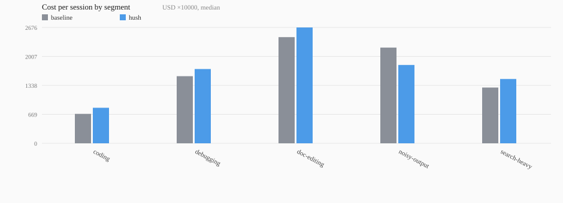

<div align="center">
  <picture>
    <source media="(prefers-color-scheme: dark)" srcset="assets/logo-dark.svg" />
    
  </picture>
  <h1>hush</h1>
  <p><strong>Claude talks a lot while it works, and you pay for every word. hush turns down the chatter.</strong></p>

  

  <p><em>This is what a session sounds like.</em></p>
</div>

<p align="center">
    <a href="https://github.com/V-Songbird/hush/stargazers"></a>
    <a href="https://github.com/V-Songbird/hush/blob/main/LICENSE"></a>
    <a href="https://docs.anthropic.com/en/docs/claude-code"></a>
</p>

> **TL;DR** — Claude bills you for every log line, build dump, and word of play-by-play. hush trims them at the source in the loud sessions: the noisy-build rows of our benchmark suite come in 18% cheaper, and the suite average drops from $0.185 to $0.179. Short, quiet jobs have nothing to cut and can cost a little more.

---

## What is this?

Claude talks a lot while it works. "Let me look at the codebase." "Now I'll check the config." Then four hundred lines of build output you never asked for — and, right at the end, the one sentence you actually needed.

hush doesn't ask Claude to "be more concise" and hope for the best. It trims the actual bulk — logs, command output, narration — at the source, before any of it hits your bill. It's a specialist, and it says so on the tin: it earns its keep in sessions that read logs, run builds, and keep going turn after turn, because that's where the noise lives. Ask it a one-shot question with no tools involved and there's nothing to trim — you'll pay hush's own small overhead for the quieter reply.

And the one message you do get is built to be read on an empty tank. Answer first. Everyday words instead of jargon, because swapping a word is free and explaining one costs you a line. Hard caps on the whole thing: 12 lines, 15 words a sentence. If you have ADHD, or you're just fried at the end of a long day, that's the point — nothing to wade through, and nothing you're assumed to already know.

## Why you'd want it

- **Cheaper noisy sessions.** The two biggest sources of bulk — machine output and narration — get shrunk, so the long, loud sessions cost less.
- **Easier to read.** The answer sits at the top of one final message, not buried in a play-by-play.
- **Your files are never touched, and big output is saved before it's shortened.** Anything large enough to be parked out of the chat is written whole to a local file the summary points at. Smaller trims keep the lines that carry signal — errors, warnings, failures — and drop the repetitive middle, and a failing command gets far more room than a clean one.
- **Zero setup.** Install it and the trimming and the quiet final message are on. There is nothing to configure and nothing to learn.

## How it works

hush picks up three small habits the moment you install it:

| Moment | What happens |
| --- | --- |
| Progress narration | Swapped for one clean summary at the end |
| Command output & log files | Trimmed as they come in — a short tail from a clean run, up to 250 lines from a failing one, with the error and warning lines pulled through |
| Really large output (a huge log, a giant lockfile) | Parked in a local file behind a short summary, so it isn't re-sent in full every turn |

That's the whole list. No workflow to learn, no dial to find first. It's simply how Claude behaves now.

> [!IMPORTANT]
> **A command that fails is not trimmed on a default install.** When a command exits non-zero, Claude Code gives hush no way to replace that output, so the whole thing arrives as-is. hush can only trim a failing command when the session runs in `bypassPermissions` mode, or when you set `HUSH_WRAP=1`. The benchmark figures below were measured with `HUSH_WRAP=1` — read the rows about builds and failures with that in mind.

## Install

Inside Claude Code, run:

```
/plugin marketplace add V-Songbird/foundry
/plugin install hush@foundry
```

It kicks in at your next session — nothing to configure. hush works quietly in the background.

Running [razor](https://github.com/V-Songbird/razor) too? Good instinct — the pair plays clean, see [Better together](#better-together) below.

## What you can do

hush runs itself. Two commands sit off to the side, for when you want the final message in a different voice:

| You want to… | Command |
| --- | --- |
| Try one of the output styles hush ships, or hand back to stock | `/hush:pick-style` |
| Build an output style in your own voice on hush's silent frame | `/hush:craft-style` |

`/hush:pick-style` is the shelf. Every style on it runs the same silent machinery underneath — they differ only in what that one last message is *for*:

| Style | What the final message does |
| --- | --- |
| **Glyph** | Emoji-telegram reports — an emote replaces each obvious word |
| **Rock** | Stone Age dialect — noun chains, no articles, `=` for cause |
| **Pirate** | Every report in full pirate dialect, outcome first |
| **Sensei** | Teaches the change at newcomer depth — the why and how, closed by a `Lesson:` and a `Check:`. No length cap |

`/hush:craft-style` goes one further: your own voice, written to a file you own, and a verifier that checks hush's mechanics came through the rewrite — every number, every cap, every rule, one paragraph for one paragraph.

Ask for a pirate and you get a pirate — `be` for is, `ye` for you, dropped g's, the whole way through, with the paths and the error text still exact. The trick is that your voice gets written into every line of the style file, not just the line that names it: Claude answers in the register it was handed. `craft-style` does that part for you. Want it terser than stock's readability rules allow? Ask for maximum compression — the skill strips the readability frame Rock-style, keeps the silence and the exact-facts contract, and tells you what you traded.

Both commands ask before they swap, both take effect at your next session, and stock hush is always one command away. Updating the plugin hands the style slot back to stock, so re-pick your style after an update. One honest caveat: only the built-in style is benchmarked — the presets and anything you craft are unmeasured, and the numbers on this page belong to stock.

**See them side by side.** Same bug, same fix, five sign-offs — [`styles/README.md`](styles/README.md).

## Benchmarks

We put hush up against plain Claude Code on 17 fixed jobs: full agent sessions that explore, edit, and run code in seeded throwaway repos built for the purpose. Same jobs, phrased the way a developer actually types them, real cost read straight from the API. Five kinds of work, so you can find the rows that look like yours.

<p align="center"></p>

**hush wins where the noise lives.** On the jobs built around loud builds and big logs, the typical session drops 18% — and hush is cheaper on three of those four jobs, with the fourth a wash. Across the whole suite, the mean bill goes from $0.185 to $0.179.

**And it loses where there's nothing to cut.** A short coding question, a search across files, an edit to a document — those sessions carry hush's own small overhead and no bulk to trim, and they cost 9% to 21% more. If your day has no noisy sessions in it, hush is the wrong tool. That's the honest trade.

**You read a third less either way.** The typical final reply is 69 words against 102 — one message at the end, answer first, instead of pieces trickling in while Claude works.

**And it stays quiet until it's done.** That's the waveform at the top of this page — every session in the suite, one spike per run. hush is silent in 81 sessions of 85; the loudest thing it said all suite was 24 words. It isn't a gag order: Claude still speaks up to flag something you'd want to stop, or when it's blocked and needs you.

### The full picture

Every kind of work, the wins **and** the losses. Typical (median) cost per session, on Sonnet.

| Kind of work | no plugin | hush | change | worst single job for hush |
| --- | --- | --- | --- | --- |
| Noisy builds and logs (4 jobs) | $0.221 | **$0.181** | −18% | the noisy build, a wash |
| Debugging (6 jobs) | **$0.155** | $0.172 | +11% | a small pagination fix, +27% |
| Ordinary coding (4 jobs) | **$0.068** | $0.082 | +21% | a no-tools explanation, +36% |
| Doc editing (1 job) | **$0.245** | $0.268 | +9% | the runbook edit, +9% |
| Search-heavy (2 jobs) | **$0.129** | $0.149 | +15% | summarize a repo, +18% |
| **Whole suite (mean)** | $0.185 | **$0.179** | **−3%** | |

Both setups passed the same share of correctness checks, so none of the savings came from cheaper-but-wrong answers.

Read the rows, not just the last one. The average is the average of *this* suite with every job weighted the same. Your bill will follow whichever rows look like your work.

**The same suite ran on Haiku as a cross-check.** The mean bill drops about 10% there and the typical session is a wash — but hush's runs also failed slightly more correctness checks than the plain setup did. On the smaller model, treat hush as a silence tool first and a cost tool second.

### Reading it is the other half

A cheaper session you can't read isn't a win. So we scored the one final message each setup shipped, on measures none of us invented: Flesch Reading Ease, the US grade level the prose reads at, how long the sentences run, and how much it leans on long words. Same scorer, every setup, no tool marked against its own rulebook.

And we put hush next to two plugins built for exactly this job — [i-have-adhd](https://github.com/ayghri/i-have-adhd), which shapes output for an ADHD reader, and [simple-english](https://github.com/AminBlg/SimpleEnglish), which writes in the controlled English aerospace has used since 1983. Same 17 jobs, same run, on Sonnet.

| Setup | words | lines | words per sentence | long words | reading ease | grade level | ends with something to run |
| --- | --- | --- | --- | --- | --- | --- | --- |
| no plugin | 96 | 4 | 15.4 | 10.5% | 68.4 | 7.5 | **94%** |
| **hush** | 74 | 3 | 12.9 | **7.0%** | **79.9** | 5.3 | 77% |
| i-have-adhd | 48 | 3 | 10.5 | 8.2% | 77.3 | **5.1** | 82% |
| simple-english | 80 | 4 | 12.7 | 7.1% | 76.7 | 5.7 | 90% |
| caveman | 45 | 3 | **8.8** | 9.5% | 70.9 | 5.5 | 75% |

**hush writes the easiest prose in the room.** Highest reading ease, fewest long words, and it takes the reply down from a grade-eight read to a grade-five one. Both models agree on that.

**And it hands you a next step less often than it should.** 77% of hush's replies end with something you can actually run, against 82% for the ADHD plugin and 94% for plain Claude. That's the one column where a tool built for the same reader beats us. We'd rather print it than bury it.

**Nobody else goes quiet, though.** Every plugin on that table shortens words. Only hush also stops the play-by-play while it works — it said nothing at all in 48 sessions of 51, where the quietest of the others managed 22.

*How we tested: same jobs, two setups, several runs each in fresh throwaway workspaces, on Sonnet — headless agent sessions driven end to end, never a single generated reply — costs read from the API, not estimated. The repos are purpose-built fixtures, not open-source checkouts, and two of the 17 jobs run across several turns. Numbers move a few percent between runs. The cost tables and the reading table come from two different runs, so read each one against itself and never across. Reproduce it yourself — the suite and every run record live in [the marketplace repo](https://github.com/V-Songbird/foundry/tree/main/benchmarks/hush).*

### Better together

hush pairs naturally with [razor](https://github.com/V-Songbird/razor): razor cuts the code, hush cuts the noise, and they fire on different moments of a session, so neither notices the other. Both enforce with hooks rather than asking nicely — asking works right up until the model forgets.

## Under the hood

Every trim above happens locally as Claude works — read the plugin's files if you want the exact mechanics. `craft-style` copies those measured mechanics verbatim into a new style file in your own `output-styles` folder, checked by a mechanical verifier; the four shipped presets are built the same way and pass the same verifier. With your say-so `pick-style` swaps whichever one you chose into hush's own slot so it binds like stock, and swaps stock back on request. A plugin that takes plugins, more or less. Pairs naturally with [razor](https://github.com/V-Songbird/razor): razor cuts the code, hush cuts the noise. Run both and neither notices the other (see [Better together](#better-together)).

## Settings

Most people never touch these. The two day-to-day ones:

| Variable | What it does |
| --- | --- |
| `HUSH_DISABLE=1` | Stops every hook — no compression, no reminders, no files written. The output style is a separate switch: run `/hush:pick-style` to hand the slot back to stock, or uninstall |
| `HUSH_DEBUG=1` | Writes a local record of what hush did to each tool output — sizes in and out, and where the full copy went |

`HUSH_WRAP=1` is a third, situational switch — it lets hush trim failing commands too; see the callout under [How it works](#how-it-works).

There are no compression levels and no profiles. hush has one policy.

## Good to know

- **Getting the full output back.** When hush parks something big in a file, the summary names that file — read it and you have every byte. If the file is gone, run the command again; a second run isn't guaranteed to produce the same output as the first, so hush never claims it regenerates what was lost.
- **Turning it off is two switches.** `HUSH_DISABLE=1` stops everything hush does while a session runs. The output style is separate — it's chosen at session start, so hand the slot back with `/hush:pick-style`, or uninstall.
- **Where the parked output lives.** Your operating system's temp folder, in `hush-sidecar`, in a folder of its own for each session, one file per output, written only readable by you where the OS supports that. When a long session gets summarized to free up room, the parked files stay put and the summary keeps their paths. hush deletes that folder when the session ends, and clears anything a crashed session left behind once it's a day old. Anything you'd hate to see in a temp file, keep out of the terminal.
- **Windows caveat.** Same atomic writes and the same refusal to follow symlinks, but the read-only-to-you file mode isn't enforceable there — treat parked output as readable by anything running as you.

## License

MIT — see [LICENSE](./LICENSE).
