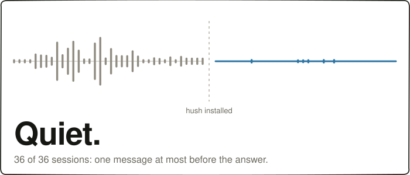

<div align="center">
  <picture>
    <source media="(prefers-color-scheme: dark)" srcset="assets/logo-dark.svg" />
    
  </picture>
  <h1>hush</h1>
  <p><strong>Claude talks a lot while it works, and you pay for every word. hush turns down the chatter.</strong></p>

  

  <p><em>Three runs of the same eight jobs the tables below measure, on the default setting. 48 sessions each way.</em></p>
</div>

<p align="center">
    <a href="https://github.com/V-Songbird/hush/stargazers"></a>
    <a href="https://github.com/V-Songbird/hush/blob/main/LICENSE"></a>
    <a href="https://docs.anthropic.com/en/docs/claude-code"></a>
</p>

> **TL;DR** — Claude talks a lot while it works, and dumps every log line into the conversation. hush cuts that noise: about a third of the machine output, and nearly all the play-by-play. What you get back is one short, readable answer at the end. Whether it saves you money depends on how much your commands print — a lot, and it pays for itself; a little, and it costs you a little.

---

## What is this?

Claude talks a lot while it works. "Let me look at the codebase." "Now I'll check the config." Then four hundred lines of build output you never asked for. And at the very end, the one sentence you actually needed.

hush trims that bulk — logs, command output, play-by-play — at the source, before Claude has to read any of it back. It earns its keep in sessions that read logs, run builds, and keep going turn after turn. A short question that runs nothing has nothing to trim. There you pay a little more for the quieter reply.

And the one message you do get is built to be read on an empty tank. Answer first. Everyday words. One fact per sentence. It aims for twelve lines, and sentences of about ten words. Made for ADHD readers, and for anyone fried at the end of a long day.

## Why you'd want it

- **Noisy sessions get quiet.** The two biggest sources of bulk — machine output and the play-by-play — get shrunk at the source, before Claude has to read them back.
- **Easier to read.** The answer sits at the top of one final message, not buried in a play-by-play.
- **Your files are never touched, and big output is saved before it's shortened.** The summary points at the saved file. Smaller trims keep the error and warning lines and drop the repetitive middle.
- **Zero setup.** Install it and it's on. Nothing to configure, nothing to learn.

## How it works

| Moment | What happens |
| --- | --- |
| The play-by-play while it works | Swapped for one clean summary at the end |
| Command output & log files | Trimmed as they come in — a short tail from a clean run, up to 250 lines from a failing one, with the error and warning lines pulled through |
| Really large output (a huge log, a giant lockfile) | Parked in a local file behind a short summary, so it isn't re-sent in full every turn |

That's the whole list. No workflow to learn, no dial to find first.

> [!IMPORTANT]
> **A command that fails is not trimmed on a default install.** Claude Code only lets hush replace failing output when the session has stopped asking you to approve each step, or when you set `HUSH_WRAP=1`. The figures below were measured with `HUSH_WRAP=1`.

## Install

Inside Claude Code, run:

```
/plugin marketplace add V-Songbird/foundry
/plugin install hush@foundry
```

It kicks in at your next session — nothing to configure.

Running [razor](https://github.com/V-Songbird/razor) too? They work at different moments of a session, so neither trips over the other.

## What you can do

hush runs itself. Two commands sit off to the side, for when you want that last message written in a different voice. Claude Code calls a writing voice an **output style**, and hush ships a few:

| You want to… | Command |
| --- | --- |
| Try one of the voices hush ships, or go back to the one it installs | `/hush:pick-style` |
| Build a voice of your own on hush's quiet frame | `/hush:craft-style` |

Every style runs the same silent machinery. They differ only in the voice of that one last message:

| Style | What the final message does |
| --- | --- |
| **Glyph** | Emoji-telegram reports — an emote replaces each obvious word |
| **Rock** | Stone Age dialect — noun chains, no articles, `=` for cause |
| **Pirate** | Every report in full pirate dialect, outcome first |
| **Sensei** | Teaches the change at newcomer depth — the why and how, closed by a `Lesson:` and a `Check:`. No length cap |

`/hush:craft-style` writes a new voice from your description, then checks that the quiet machinery survived the rewrite. Both commands ask before they swap, and take effect at your next session. Updating the plugin puts the voice hush ships back, so pick again after an update. Only that one was measured — the numbers on this page belong to it.

**See them side by side.** Same bug, same fix, five sign-offs — [`styles/README.md`](styles/README.md).

## Benchmarks

We gave the same eight jobs to plain Claude Code, and to Claude Code with hush. Real sessions: it reads files, edits code, runs commands. Noisy builds, big log files, wide renames, and long jobs where the plan keeps changing. Every price below is the real bill from the API.

<p align="center"></p>

**hush cuts the noise. The bill comes out about the same.** Command output drops by a third, and the running commentary all but disappears. Whether hush saves you money depends on your work. [The next table](#when-it-saves-you-money-and-when-it-costs-you) says exactly when.

**And you read it in silence.** hush finished the whole session without a word of play-by-play in 12 jobs of 16 — plain Claude Code managed that in 3. It still speaks up to flag something you would want to stop, or when it is stuck and needs you.

### When it saves you money, and when it costs you

It comes down to one thing: **how much your commands print.**

A step is one round trip: Claude thinks, runs something, reads the result. hush carries its writing rules along on every one of those. That is a small fixed cost, paid every step. It earns the cost back by trimming what your commands print. When there is little to trim, you just pay it.

Here is every job from the run, ordered by how much its commands printed:

| The job | printed per step | no plugin | hush | change |
| --- | --- | --- | --- | --- |
| Build a notification router while the plan changes four times | 1.0k | $0.456 | $0.675 | +48% |
| Fix a red test suite hiding three real failures | 1.6k | $0.192 | $0.215 | +12% |
| Get a build clean again after a dependency bump | 2.4k | $0.199 | $0.219 | +10% |
| Finish a half-done rename across 76 files | 2.8k | $0.494 | $0.577 | +17% |
| Scope a column rename that matches a thousand lines | 3.1k | $0.202 | $0.223 | +11% |
| **— around here the two swap places —** | **~3.5k** | | | |
| Dig through 300 KB of logs for the cause of an outage | 4.4k | $0.596 | **$0.406** | **−32%** |
| Find what actually changed for users across 380 commits | 10.3k | $0.592 | **$0.480** | **−19%** |
| Triage a 57 KB application log | 20.0k | $0.298 | **$0.247** | **−17%** |

The line sits at about **3,500 characters printed per step**. We checked it against 48 job-and-run pairs drawn from seven separate runs, and 47 of them land on the right side of it.

**So: if your day is builds, logs and big searches, hush pays for itself. If it is small edits and short commands, it costs you a little.** Every setup got every job right this run, 16 of 16 each, so none of this was bought with a wrong answer.

### Reading it is the other half

Saving money is only half of it. The other half is whether you can read the answer. So we scored the one final message each setup wrote, using measures that have been around for decades — reading ease, US school grade level, sentence length, and how many long words it uses.

Racing beside hush: Claude Code's own **Concise** style, which ships in the tool and costs nothing, plus three community styles — [i-have-adhd](https://github.com/ayghri/i-have-adhd), built for ADHD readers, [simple-english](https://github.com/AminBlg/SimpleEnglish), the controlled English aerospace writes manuals in, and [caveman](https://github.com/JuliusBrussee/caveman), which strips answers to the bone. Same eight jobs, same run, on Sonnet.

| Setup | words | words per sentence | long words | reading ease | grade level | silent sessions |
| --- | --- | --- | --- | --- | --- | --- |
| no plugin | 117 | 15.6 | 11.0% | 63.3 | 8.3 | 3 of 16 |
| **hush** | 101 | 11.1 | **7.8%** | **76.5** | **5.3** | **12 of 16** |
| Concise (built in) | 104 | 14.8 | 10.1% | 66.2 | 7.7 | 7 of 16 |
| i-have-adhd | 102 | 17.1 | 10.9% | 61.3 | 8.9 | 5 of 16 |
| simple-english | 152 | 16.0 | 11.0% | 63.4 | 8.4 | 4 of 16 |
| caveman | **56** | **10.5** | 10.8% | 66.8 | 6.6 | 7 of 16 |

Higher reading ease is easier. Lower grade level is easier.

**hush reads easiest of the pack *and* goes quiet.** Three school grades easier than plain Claude Code, and the fewest long words on the board — and it is still the one that finishes a session in silence most often. caveman writes much shorter messages but not simpler ones. The honest loss: hush leaves you something you can copy and run 75% of the time, plain Claude 81%.

Here is what that reads like. A real final message from this run, the dependency-bump job, exactly as hush wrote it:

> Build's clean now. 0 errors, exit code 0.
>
> Two real bugs from the bump, both in the link stage:
>
> 1. `src/core/options.js` still read `options.retries`, but the new bundler passes `retryCount`. That crashed the build outright.
> 2. `src/net/retryPolicy.js` treated an unset backoff flag as invalid instead of "off," which would've broken the second build attempt.
>
> Fixed both. The rest of the warnings (deprecation notices, unused export, circular import) are just noise from the bump, not build-breaking, so I left those alone.

### Why not just use Concise?

Claude Code ships its own **Concise** style. It costs nothing and it is already on your machine, so it is a fair thing to ask. The difference is what each one can reach. Concise is a set of writing rules, so it makes Claude write less — but it cannot change what your commands print. Over the same eight jobs it read back 35.0k characters of command output per session, against 35.4k with no plugin at all. That is no cut. hush read back 24.1k, because it trims the output on the way in.

The line from the table above applies here too. Across the whole suite Concise came out a little cheaper. On the loud jobs hush came out ahead of it — 32% cheaper on the outage dig, 14% on the log triage. So if your day is small edits and short commands, take Concise: it is free and already there. If your commands print a lot, hush is the one that pays for itself. It also goes quiet more often, 12 sessions of 16 against 7, says 4.8 words of play-by-play against 22.7, reads two school grades easier, and keeps a copy of everything it trimmed.

*How we tested: eight jobs, six setups, two runs each, in fresh throwaway folders, on Sonnet. Real sessions from start to finish, never a single canned reply, and every price read back from the API. One row can swing ten or twenty points between runs, so read the direction, not the decimal — the ordering by how much a job prints is what held up across seven separate runs. Reproduce it yourself: [the marketplace repo](https://github.com/V-Songbird/foundry/tree/main/benchmarks/hush).*

## Under the hood

Every trim happens on your machine as Claude works — read the plugin's files if you want the exact mechanics. `/hush:pick-style` puts the voice you chose where Claude Code looks for hush's, so Claude picks it up the same way, and puts the original back on request.

## Settings

Most people never touch these. By default hush reminds Claude to stay quiet once at the start of each turn, and once more only in the moments chatter actually slips through — so a session that stays quiet pays nothing extra:

| Variable | What it does |
| --- | --- |
| `HUSH_DISABLE=1` | Stops everything hush does — no trimming, no reminders, no files written. The writing voice is a separate switch: run `/hush:pick-style` to put the original back, or uninstall |
| `HUSH_DEBUG=1` | Writes a local record of what hush did to each tool output — sizes in and out, and where the full copy went — to `hush-debug-<session>.jsonl` in your system temp folder |
| `HUSH_NUDGE=max` | As quiet as hush gets — a reminder on every tool result, whether or not anything slipped. Costs the most too |

`HUSH_WRAP=1` is a situational switch — it lets hush trim failing commands too; see the callout under [How it works](#how-it-works).

There are no levels and no profiles to pick between — hush trims one way, always.

Claude Code's own **Output style** setting is what picks Hush's voice. Installing the plugin sets it for you. If it didn't take, write it in by hand in `~/.claude/settings.json`:

```json
{
  "outputStyle": "hush:Hush"
}
```

Once it takes you can delete those lines again — `/hush:pick-style` swaps voices for you after that.

## Good to know

- **Getting the full output back.** The summary names the file hush parked. Read it and you have every byte. If the file is gone, run the command again — hush never claims it regenerates what was lost.
- **Turning it off is two switches.** `HUSH_DISABLE=1` stops everything hush does while a session runs. The voice is chosen when a session starts — put the original back with `/hush:pick-style`, or uninstall.
- **Where the parked output lives.** Your system temp folder, in `hush-sidecar`, one folder per session, readable only by you where the OS supports that. hush deletes that folder when the session ends, and clears anything a crashed session left behind once it's a day old. Anything you'd hate to see in a temp file, keep out of the terminal.
- **On Windows, one protection is missing.** hush writes those files just as carefully, but Windows can't lock them to your account alone. Treat parked output there as readable by anything running as you.

## License

MIT — see [LICENSE](./LICENSE).
