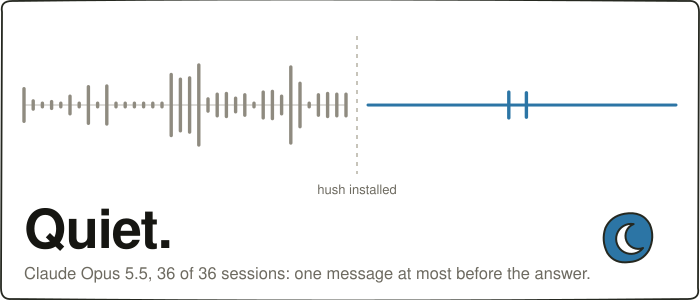

<div align="center">
  <picture>
    <source media="(prefers-color-scheme: dark)" srcset="assets/banner-dark.png" />
    
  </picture>
  <h1>hush</h1>
  <p><strong>You asked for a change. Read what changed.</strong></p>
</div>

<p align="center"><strong>Available on</strong></p>
<p align="center">
  &emsp;&emsp;<a href="#claude-code"></a><br />
  <del>Codex</del>&emsp;&emsp;&emsp;&emsp;<a href="#claude-code">Claude</a>
</p>
<p align="center"><small>Codex is not currently installable.</small></p>

<p align="center"><a href="#install"><strong>Get started</strong></a> · <a href="#what-is-this">What is this?</a> · <a href="#how-it-works">How it works</a> · <a href="#what-you-can-do">What you can do</a> · <a href="#the-numbers">Evidence</a></p>

## What is this?

You ask the assistant to fix a failing test. It reads files, runs commands and explains each step. By the time it finishes, the result is buried in the conversation. Hush reduces that reading.

It quiets routine narration, shortens noisy tool output and shapes the final answer around what changed, whether it worked and what comes next. The example illustrates the workflow; the measurements below describe recorded sessions.

<p align="center"></p>

## Why you'd want it

- Read the result with less play-by-play.
- Keep noisy command output from crowding the conversation.
- Inspect retained full output when you need more detail.
- Choose a writing voice that suits you.

## How it works

A writing style asks the assistant to stay quiet during routine work and finish with a short, useful answer. Session controls reinforce that behavior and trim selected tool results. Large outputs can be stored temporarily, with a reference for closer inspection. You can change the voice while keeping the session controls.

## What you can do

| You want to | Outcome |
| --- | --- |
| Keep the default voice | Short, plain answers focused on the result |
| Choose another voice | A different tone with the session controls retained |
| Describe a new voice | A custom style checked against Hush’s requirements |
| Inspect shortened output | A reference to the retained full result where available |

Use `/hush:pick-style` to choose a voice and `/hush:craft-style` to describe a new one. See the settings guide for disabling the session controls.

## Install

Hush runs in Claude Code. It is not available for Codex.

### Claude Code

Inside Claude Code:

```text
/plugin marketplace add V-Songbird/foundry
/plugin install hush@foundry
```

Start a new session to load the plugin. Hush's voice applies on its own. The published numbers also
set `"outputStyle": "hush:Hush"` in `~/.claude/settings.json`, which adds Claude Code's per-turn
reminder that the style is active; see [Settings](docs/knowledge/settings.md#the-output-style-setting).

## Good to know

Correctness comes before silence. A short answer can omit a useful detail, and quieter sessions do not always cost less. Ask for depth when you need it, and check the result before acting.

Full-output references point to temporary files. Disabling runtime controls and restoring the writing style are separate actions. See [Settings](docs/knowledge/settings.md) for switches, and [How hush works](docs/knowledge/how-it-works.md#where-the-parked-output-goes) for how long those files are kept and who can read them on each platform.

## The numbers

The comparison asks whether jobs were completed correctly, how often the assistant gave at most one update, and how long its final answers were. These observations do not guarantee the same behavior in your sessions.

<!-- foundry:evidence {"platform":"Claude","status":"measured","models":["Claude Opus 5"],"source":"docs/hush/validation/claude-readme-benchmark-2026-09-10.md","date":"2026-09-01","reviewedAt":"2026-09-10"} -->
| Model | Setup | Jobs right | At most one update | Median final prose words |
| --- | --- | --- | --- | --- |
| Claude Opus 5 | No plugin | 36/36 | 14/36 | 367 |
| Claude Opus 5 | caveman | 36/36 | 31/36 | 151 |
| Claude Opus 5 | hush | 36/36 | 36/36 | 69 |

In this recorded comparison, Hush’s median final prose was 69 words against 367 without a plugin—about 81% shorter. Both setups passed all 36 task checks. Hush gave at most one mid-work update in every session.

The readability check detected runnable content in 94% of Hush answers versus 100% for the other setups. Three quiet jobs cost 1–10% more. Detection is a text heuristic, not a check that the suggested action is correct or complete.

Nine fixture jobs, four repetitions per setup; batch started September 1, 2026. The published source identifies Opus 5; the records retain the alias `opus` at medium effort. Measurements used the shipped voice and `HUSH_WRAP=1`. Word counts exclude fenced code. The earlier comparisons are in [the benchmark details](docs/knowledge/benchmarks.md); the records and definitions behind them are kept outside this repository.

Anthropic also reported approximately 55% lower cost on SWE-bench Verified with Sonnet 5 after combining medium effort with concise agent output. Hush already applies concise responses in Claude Code, alongside narration controls and tool-output trimming. That result measures Anthropic’s combined optimization, not Hush. [Read Anthropic’s findings](https://claude.com/blog/reducing-cost-and-improving-performance-with-claude-platform).

<p align="center"></p>

Batch rivalA-762f888b: nine fixture jobs, four runs each, in Claude Code with Opus 5 at medium effort, September 1, 2026. These measurements describe the recorded Claude sessions, not Codex performance.

<details>
<summary>Watch the recorded Claude Code demo: one real session each on Claude Opus 5, replayed on the recorded clock, published September 4, 2026</summary>

<p align="center"></p>

</details>

*Results can vary between runs.*

## Going deeper

[How it works](docs/knowledge/how-it-works.md) · [Settings](docs/knowledge/settings.md) · [Benchmark details](docs/knowledge/benchmarks.md) · [Changelog](docs/knowledge/changelog.md)

[Foundry](https://github.com/V-Songbird/foundry) lists this plugin. The research records and the benchmark harness are kept outside this repository and are not distributed with the plugin.

## License

MIT — see [LICENSE](LICENSE).
